## AI movement strategy (technical overview)

This document describes how Gomoku Rift’s AI chooses moves (reinforce / rift, with a single-stone win as a special-case reinforce), how it narrows the move set, evaluates positions, and searches efficiently.

---

### System-level dataflow

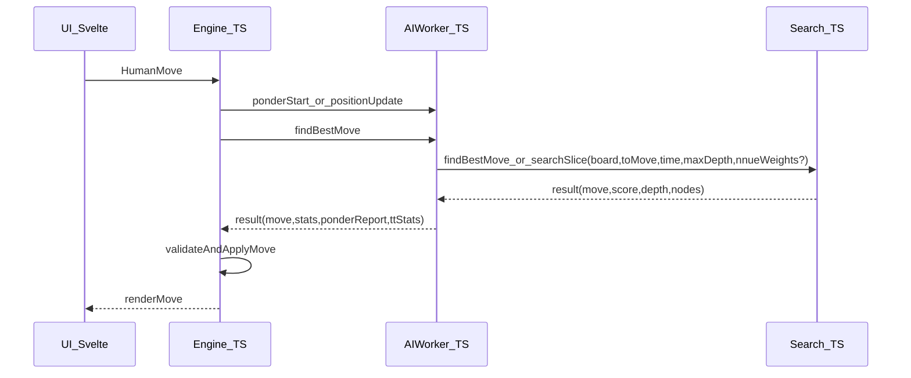

Key entrypoints:
- `src/lib/game/engine.ts`: owns worker lifecycle (one worker per color in `ai-vs-ai`), manages pondering (`ponderStart`/`positionUpdate`/`ponderStop`), sends `findBestMove`, validates worker results, applies moves.
- `src/lib/game/ai.worker.ts`: converts UI state into internal `Board`, loads NNUE weights optionally, time allocation + pondering sessions, then calls into search (`findBestMove` or `SearchSession.searchSlice` on ponder hit).
- `src/lib/game/ai/search.ts`: top-level move selection policy + iterative deepening alpha-beta (PVS) + quiescence + root safety.

---

### Core rule model (what a “move” is)

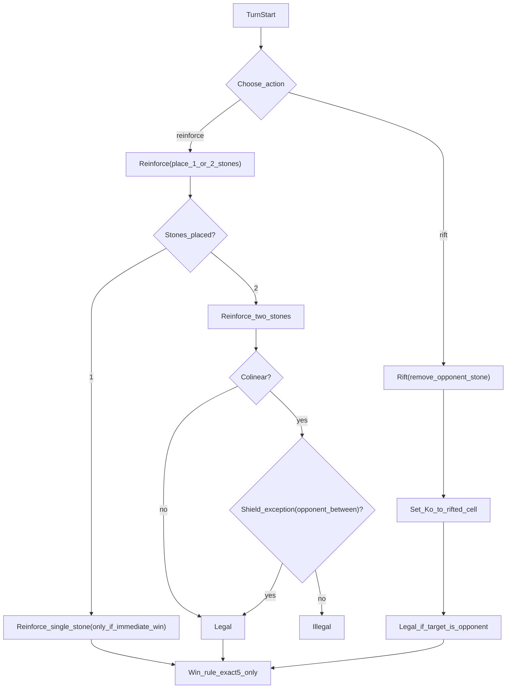

Implementation anchors:
- `src/lib/game/ai/types.ts`: `ActionType = 'reinforce' | 'rift'`; `Move = ReinforceMove | SingleWinMove | RiftMove` (note: `SingleWinMove.action` is still `'reinforce'`, with `pos2: null`).
- `src/lib/game/ai/board.ts`: legality (`validateReinforce`, `validateRift`, `checkColinearityConstraint`), application (`makeMove`/`unmakeMove`), exact-5 win checks (`checkWinAt`, `getWinnerAfterMove`).
  - Rift nuance: a `rift` can immediately create an exact-5 win for the *removed* color (by trimming an overline down to 5), so root move safety must guard against self-losing rifts.

---

### Board & hashing (what search operates on)

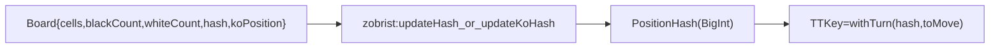

- Board is a packed `Uint8Array(225)` plus counters + `koPosition`.
- Hash includes stones + Ko; TT key xors side-to-move.
- The TT itself is a typed-array, 2-way set-associative table keyed by `withTurn(board.hash, player)`.
- Files: `src/lib/game/ai/board.ts`, `src/lib/game/ai/zobrist.ts`, `src/lib/game/ai/transposition.ts`.

---

### Candidate selection: “near existing stones”, then “best scored first”

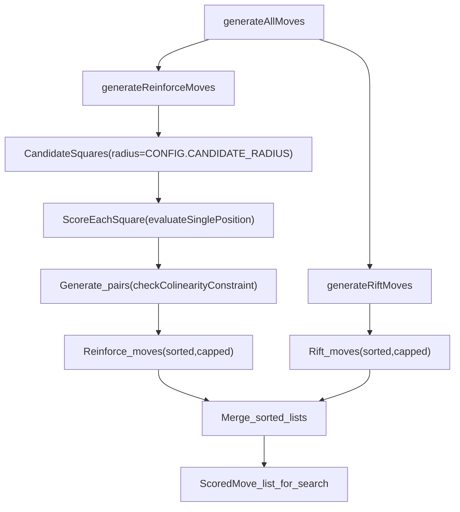

Notes:
- The radius filter is a *branching-factor control*. It is not strictly “closest-first”; the ordering is by heuristic score.
- Config knobs live in `src/lib/game/ai/constants.ts` (under `CONFIG`: `CONFIG.CANDIDATE_RADIUS`, `CONFIG.MAX_CANDIDATES`, `CONFIG.MAX_PAIRS`, `CONFIG.MAX_RIFTS`).
- Reinforce pairing uses a smaller “top slice” for combinatorics (`topCandidates = scoredCandidates.slice(0, 25)`), then caps final unique pairs with `CONFIG.MAX_PAIRS`.
- File: `src/lib/game/ai/moveGen.ts` (`getCandidatePositions`, `scoreCandidates`, `generateReinforceMoves`, `generateRiftMoves`, `generateAllMoves`).

---

### “Must-block” logic (tactical priority)

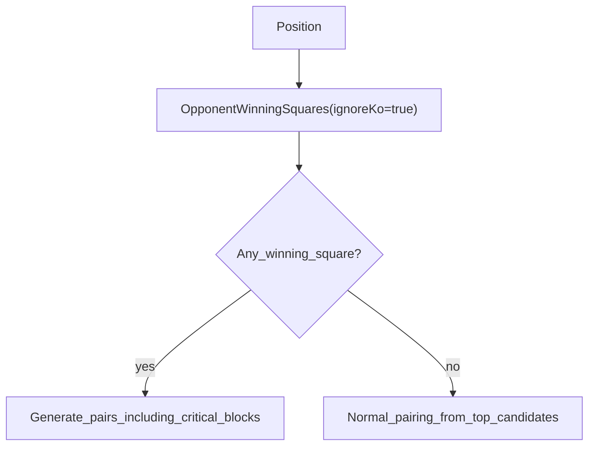

- “Opponent winning squares” come from `findWinningPositionsAssumingKoClears` (Ko ignored because it will clear on the opponent’s next ply): `src/lib/game/ai/threats.ts`.
- Critical blocks are assembled from:
  - a scratch “blocking mask” (`getBlockingMask`) derived from opponent threat patterns (notably `OPEN_FOUR`, `HALF_FOUR`, `GAP_FOUR`, `OPEN_THREE`)
  - plus any direct opponent win squares (Ko-clearing) that are currently legal placements.
- This influences both reinforce move generation (huge bonuses / enumeration of blocking pairs) and rift scoring (defensive rifts get a large bonus if they reduce opponent win squares).

---

### Pattern/threat pipeline (how “winning squares” are detected)

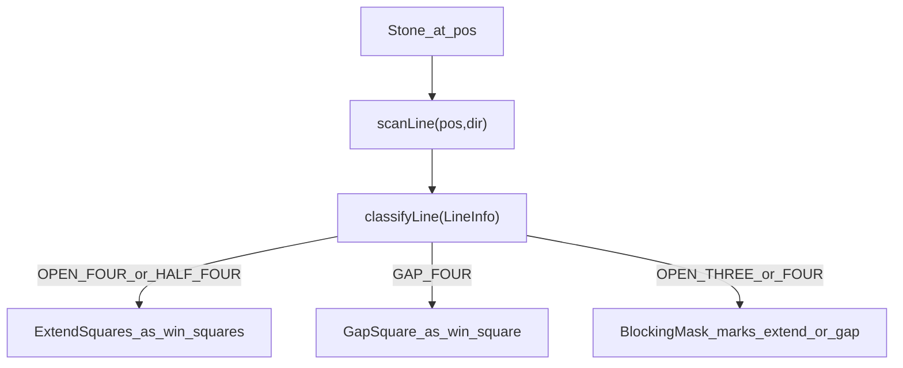

Files:
- `src/lib/game/ai/patterns.ts`: `scanLine`, `classifyLine`, `countPatterns`.
- `src/lib/game/ai/threats.ts`: `getSingleStoneWinningSquares` / `findWinningPositions*`, `getBlockingMask`, threat levels/forks.
  - Note: these APIs accept a Ko mode (`respectKo` vs `ignoreKo`) to model “Ko clears next ply” when needed.

---

### Evaluation stack (handcrafted + optional NNUE)

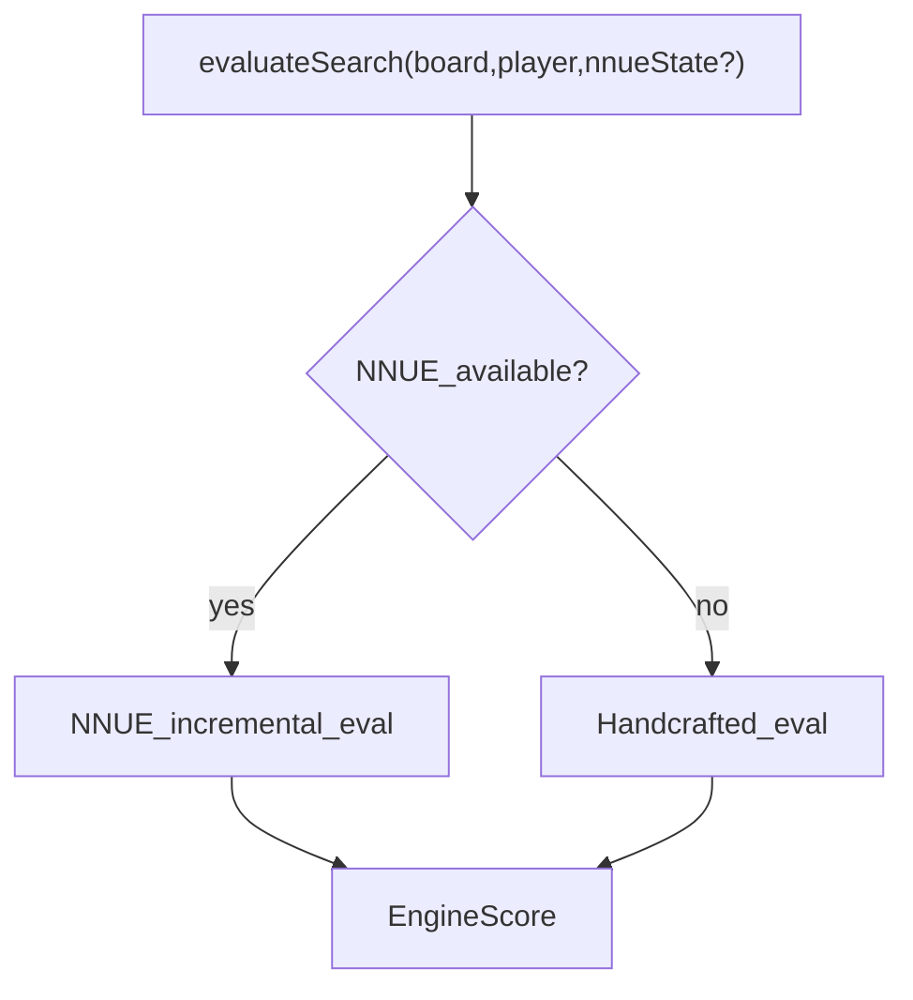

Handcrafted eval (high level):
- patterns (exact-5 aware), threat levels, fork bonuses, center/connectivity terms.
- File: `src/lib/game/ai/evaluate.ts`.

NNUE (high level):
- 1-layer accumulator: add/remove features on moves; eval is `tanh(dot(relu(hidden),outW)+bias+phase+stm)`.
- Search maps NNUE’s value in `[-1,1]` into the engine score domain via `CONFIG.NNUE_VALUE_SCALE`, and falls back to handcrafted eval if NNUE returns a non-finite value.
- Files: `src/lib/game/ai/nnue/evaluator.ts`, `src/lib/game/ai/nnue/weights.ts`.

---

### Search: top-level decision policy

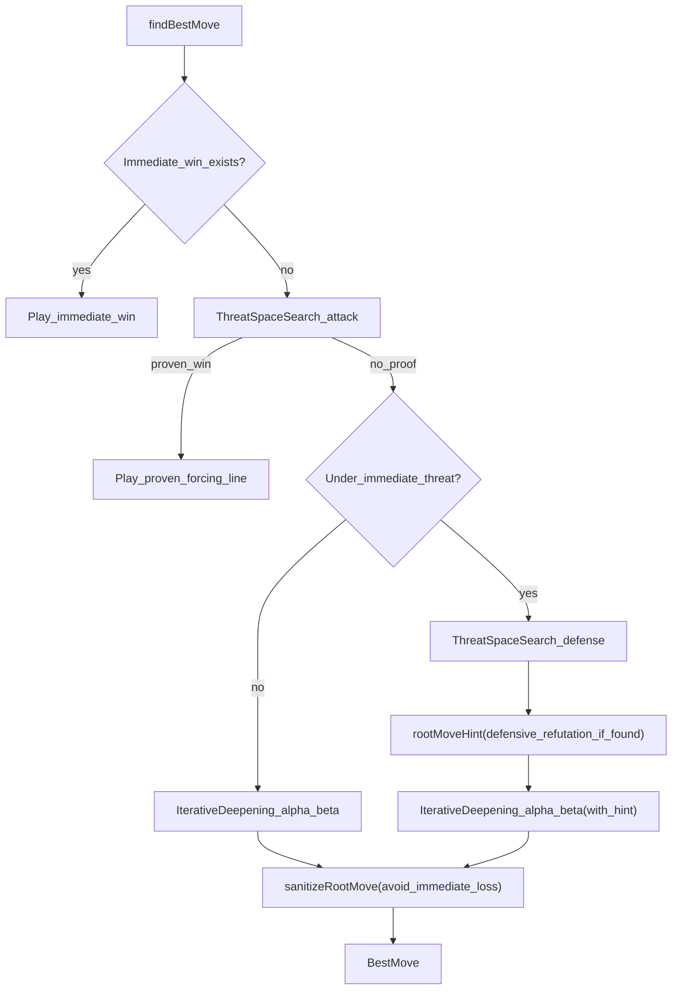

Notes:
- TSS is a conservative tactical prover for forcing chains (VCT/VCF style), adapted to Rift rules.
- Root safety rejects moves that immediately lose (including rift “exact-5 trimming” losses) or that allow an immediate opponent single-stone win (Ko-respecting), even under very small time budgets.
- File: `src/lib/game/ai/search.ts`, `src/lib/game/ai/tss.ts`.

---

### Search core: iterative deepening + alpha-beta(PVS)

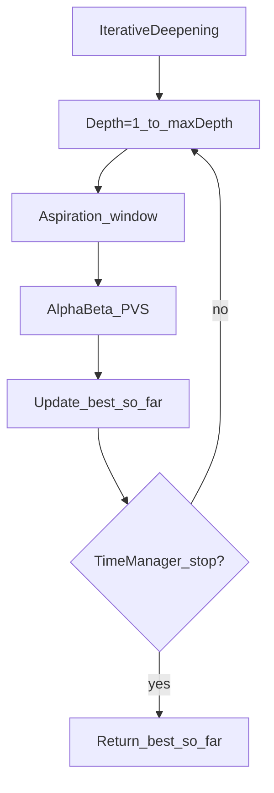

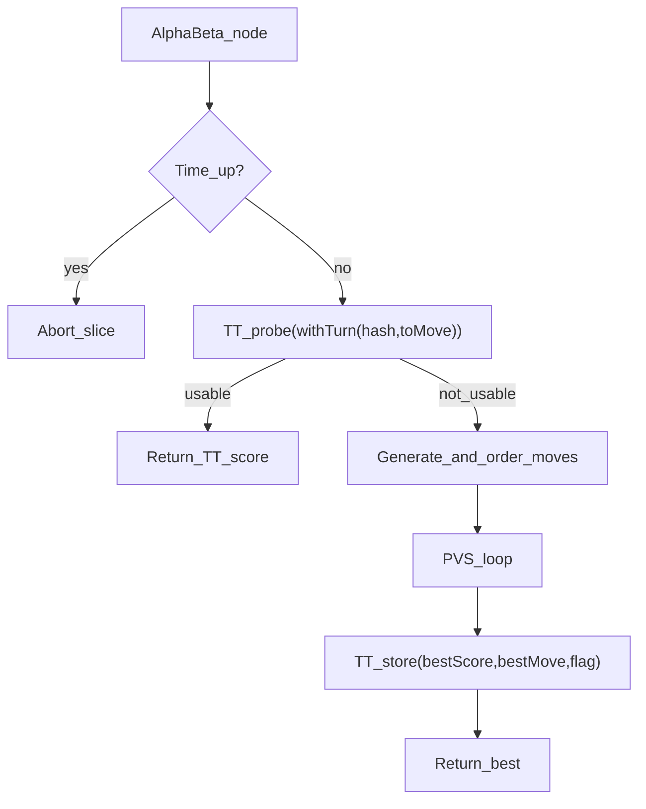

Move ordering & pruning (where strength/speed tradeoffs live):
- TT best-move hint, killer moves, history + countermove + continuation history: `src/lib/game/ai/moveOrder.ts`.
- Root progressive widening + NNUE-assisted top-K reordering.
- Razoring + NMP + LMP + LMR + futility pruning + quiescence (tactical stability via `generateTacticalMoves`): `src/lib/game/ai/search.ts`.

---

### Pondering (dual-session reuse)

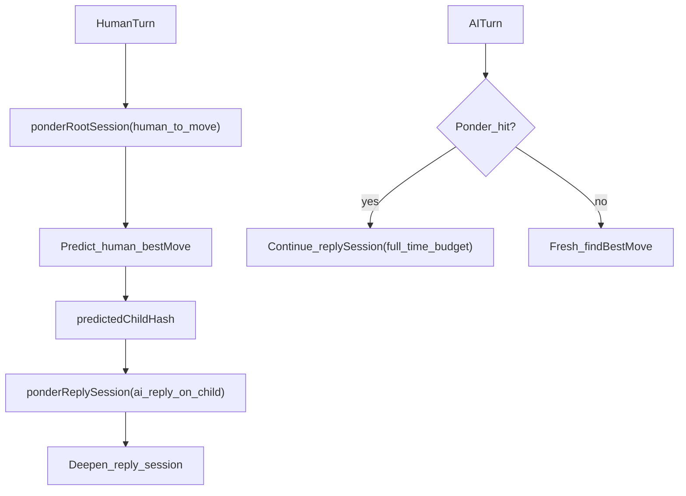

Notes:
- Engine only starts pondering in `vs-ai` during the human turn (when `currentPlayer !== aiColor`).
- The worker runs a slice loop (`sliceMs` per tick) for up to ~5s, spending most of the work on the predicted reply session, and snapshots a `ponder` summary when pausing.
- On a ponder hit (current position hash equals `predictedChildHash`), the worker continues the reply session via `SearchSession.searchSlice(timeLimitMs)` instead of starting a fresh `findBestMove`.

Implementation:
- `src/lib/game/ai.worker.ts`: maintains `ponderRootSession` + `ponderReplySession`, reuses reply session on hit.
- `src/lib/game/engine.ts`: starts/stops pondering and logs a “ponder impact” report when the move returns.

---

### Performance techniques (what makes it fast in this codebase)

This section lists the main performance-oriented techniques that are implemented today, with pointers to the relevant modules.

- **Packed board + incremental hashing (avoid expensive copies/scans)**
  - Board state is a compact `Uint8Array(225)` with stone counters and `koPosition`: `src/lib/game/ai/board.ts`, `src/lib/game/ai/types.ts`.
  - Zobrist hashing is updated incrementally on every stone add/remove and Ko change (`updateHash`, `updateKoHash`), and TT keys add side-to-move via `withTurn`: `src/lib/game/ai/zobrist.ts`.
  - Win checking is incremental at the node level: `getWinnerAfterMove` checks only the affected points (reinforce placements, or lines through the rifted cell) instead of scanning the whole board: `src/lib/game/ai/board.ts`.
  - Colinearity “shield” legality checks scan between the two stones without allocating intermediate arrays: `src/lib/game/ai/board.ts` (`checkColinearityConstraint`), also mirrored in `src/lib/game/ai/synergy.ts` (`usesShieldException`).

- **Typed-array transposition table + compact move encoding (reduce GC pressure)**
  - TT uses typed arrays (`BigUint64Array` keys + compact typed fields) and 2-way set associativity: `src/lib/game/ai/transposition.ts`.
  - Moves are encoded into a signed 32-bit integer for TT/heuristic storage (`moveCodec.ts`), avoiding object allocation in caches: `src/lib/game/ai/moveCodec.ts`.
  - Mate-distance/terminal scores are stored in a ply-neutral form in TT so they remain valid across transpositions: `src/lib/game/ai/transposition.ts` (`toTTScore`/`fromTTScore`).

- **Stamp-based scratch masks (replace `Set` allocations in hot paths)**
  - Candidate generation de-dup uses a `Uint32Array` “seen” mask with an incrementing stamp (`CANDIDATE_SEEN`): `src/lib/game/ai/moveGen.ts`.
  - Reinforce pair de-dup uses a numeric pair key + `PAIR_SEEN` stamp mask: `src/lib/game/ai/moveGen.ts`.
  - Threat/blocking computation uses a shared `BLOCK_MASK` with stamps: `src/lib/game/ai/threats.ts` (`getBlockingMask`).
  - Winning-square discovery uses a `WIN_MASK` stamp mask to avoid repeated pushes: `src/lib/game/ai/threats.ts` (`getSingleStoneWinningSquares`).
  - Pattern counting de-dups counted lines using a `COUNTED_LINES` stamp mask (avoids allocating per-line keys): `src/lib/game/ai/patterns.ts` (`countPatterns`).
  - `scanLine` / `LineInfo` is intentionally scalar (e.g. `gapPos`, `extend1`, `extend2`) to avoid per-call array allocations in the pattern hot path, and line scans are bounded (`maxRun = 6`): `src/lib/game/ai/patterns.ts`.

- **Precomputed tables (movegen + evaluation)**
  - Candidate neighbor lists within `CONFIG.CANDIDATE_RADIUS` are precomputed once (`NEIGHBORS`) for fast “near-stone” candidate enumeration: `src/lib/game/ai/moveGen.ts`.
  - `CENTER_BONUS` is precomputed for positional scoring: `src/lib/game/ai/constants.ts`.

- **Branching-factor control by construction**
  - Candidate/move list sizes are capped (`CONFIG.MAX_CANDIDATES`, `CONFIG.MAX_PAIRS`, `CONFIG.MAX_RIFTS`), and root search additionally uses progressive widening: `src/lib/game/ai/constants.ts`, `src/lib/game/ai/moveGen.ts`, `src/lib/game/ai/search.ts`.
  - `generateAllMoves` merges two already-sorted lists (reinforce + rift) to avoid an extra `O(n log n)` sort in the hot path: `src/lib/game/ai/moveGen.ts`.
  - Some hot-path “membership” checks intentionally use small linear scans instead of allocating `Set`s (e.g., tactical win-block detection): `src/lib/game/ai/moveGen.ts` (`generateTacticalMoves`).

- **Search efficiency (ordering + pruning + stable time control)**
  - Alpha-beta uses PVS, aspiration windows, and quiescence with tactical-only move generation (`generateTacticalMoves`) plus delta pruning: `src/lib/game/ai/search.ts`, `src/lib/game/ai/moveGen.ts`.
  - Pruning/reduction suite includes (with conservative guardrails): razoring, null-move pruning (disabled under tactical danger), late-move pruning, late-move reductions, futility pruning: `src/lib/game/ai/search.ts`.
  - Ordering combines TT best-move, killer moves, history, countermove, and continuation history; all backed by typed arrays to avoid per-node allocations: `src/lib/game/ai/moveOrder.ts`.
  - `ScoredMove.orderScore` is stored on the move objects to avoid allocating parallel “order score” arrays per node: `src/lib/game/ai/types.ts`, `src/lib/game/ai/moveOrder.ts`.
  - Some tactical “danger” checks are computed lazily and cached per node to avoid repeated threat scans (`cachedDanger`): `src/lib/game/ai/search.ts`.
  - Iterative deepening stops via a small `TimeState` gate (soft/hard limits) rather than only “time up” checks: `src/lib/game/ai/timeManager.ts`, `src/lib/game/ai/search.ts`.

- **Evaluation hot-path micro-optimizations**
  - Pattern scoring avoids `Object.entries` and similar allocation-heavy constructs in the evaluation hot path: `src/lib/game/ai/evaluate.ts`.

- **TSS (tactical prover) bounded + memoized**
  - Threat space search is bounded by `maxPlies/maxAttackerMoves/maxDefenderMoves`, memoizes by `withTurn(hash,toMove)`-derived keys, and keeps a small cross-call root cache: `src/lib/game/ai/tss.ts`.
  - TSS uses compact move encoding in memo entries (`encodeMove`/`decodeMove`) to keep caches small: `src/lib/game/ai/tss.ts`, `src/lib/game/ai/moveCodec.ts`.

- **NNUE incremental evaluation (fast leaf eval + ordering assistance)**
  - Incremental accumulator (`NnueState`) supports O(hiddenDim) updates per move and avoids re-evaluating from scratch: `src/lib/game/ai/nnue/evaluator.ts`.
  - Root move ordering optionally rescoring the top-K moves with NNUE uses cheap “apply move → eval → unapply move” loops: `src/lib/game/ai/search.ts`.
  - NNUE weights are optional; runtime falls back to handcrafted eval when missing/corrupt: `src/lib/game/ai/nnue/weights.ts`, `src/lib/game/ai/evaluate.ts`.

- **Worker-level reuse + responsiveness**
  - NNUE weight loading is cached via a single promise to avoid repeated fetch/parse work: `src/lib/game/ai.worker.ts`.
  - Pondering uses two search sessions (root prediction + reply) and reuses the reply session on a ponder hit via `SearchSession.searchSlice`, preserving TT/history/PV state: `src/lib/game/ai.worker.ts`, `src/lib/game/ai/search.ts`.
  - The ponder loop yields to the worker event loop (`setTimeout(resolve, 0)`) to remain responsive under continuous background search: `src/lib/game/ai.worker.ts`.

- **Measurement & regression harnesses (supporting performance work)**
  - Nodes/sec benchmark with warm-up to reduce JIT noise: `src/lib/game/ai/benchmark.ts`.
  - Tactical regression puzzles cover tricky edge cases (including overline/Ko) and guard against known move-selection pathologies; useful when refactoring for performance: `src/lib/game/ai/puzzles.ts`, `scripts/run_puzzles.ts`.

### Appendix: module map

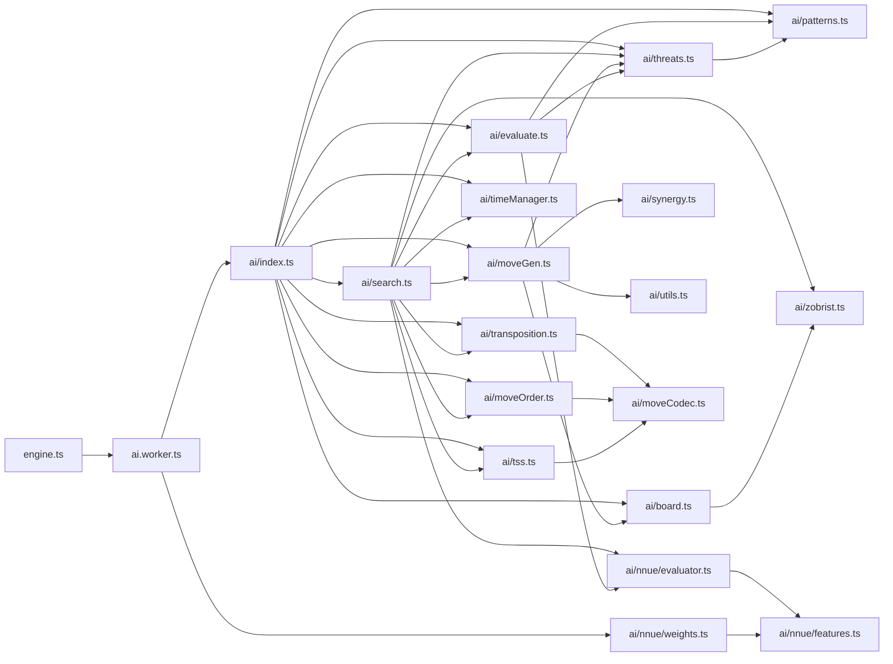

