## AI movement strategy (technical overview)

This document describes how Gomoku Rift’s AI chooses moves (reinforce / single-win / rift), how it narrows the move set, evaluates positions, and searches efficiently.

---

### System-level dataflow

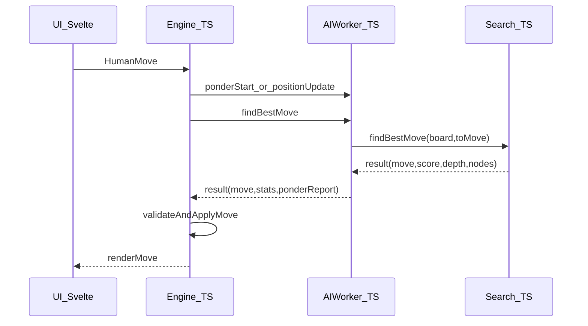

Key entrypoints:
- `src/lib/game/engine.ts`: starts/stops pondering, sends `findBestMove`, validates worker results, applies moves.
- `src/lib/game/ai.worker.ts`: time allocation + pondering + calls into engine search.
- `src/lib/game/ai/search.ts`: top-level move selection + iterative deepening alpha-beta.

---

### Core rule model (what a “move” is)

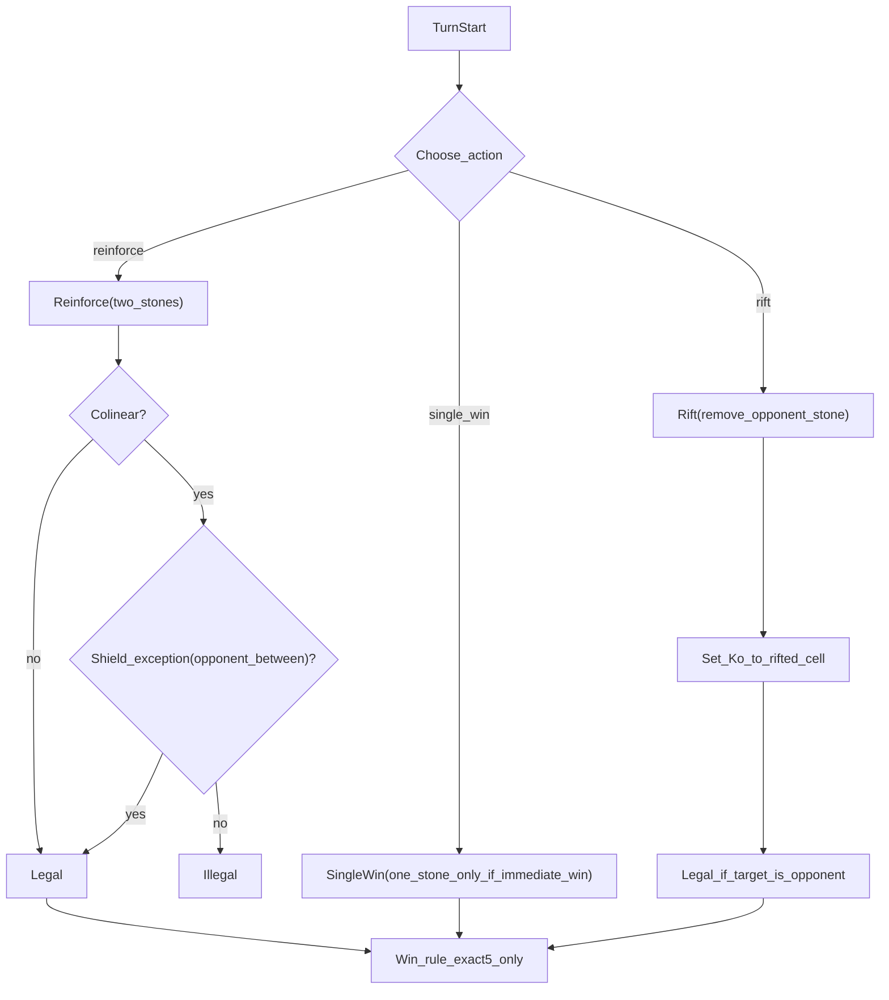

Implementation anchors:
- `src/lib/game/ai/types.ts`: `Move = ReinforceMove | SingleWinMove | RiftMove`.
- `src/lib/game/ai/board.ts`: legality (`validateReinforce`, `validateRift`), application (`makeMove`/`unmakeMove`), exact-5 win checks (`checkWinAt`, `getWinnerAfterMove`).

---

### Board & hashing (what search operates on)

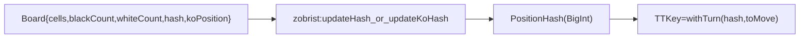

- Board is a packed `Uint8Array(225)` plus counters + `koPosition`.
- Hash includes stones + Ko; TT key xors side-to-move.
- Files: `src/lib/game/ai/board.ts`, `src/lib/game/ai/zobrist.ts`, `src/lib/game/ai/transposition.ts`.

---

### Candidate selection: “near existing stones”, then “best scored first”

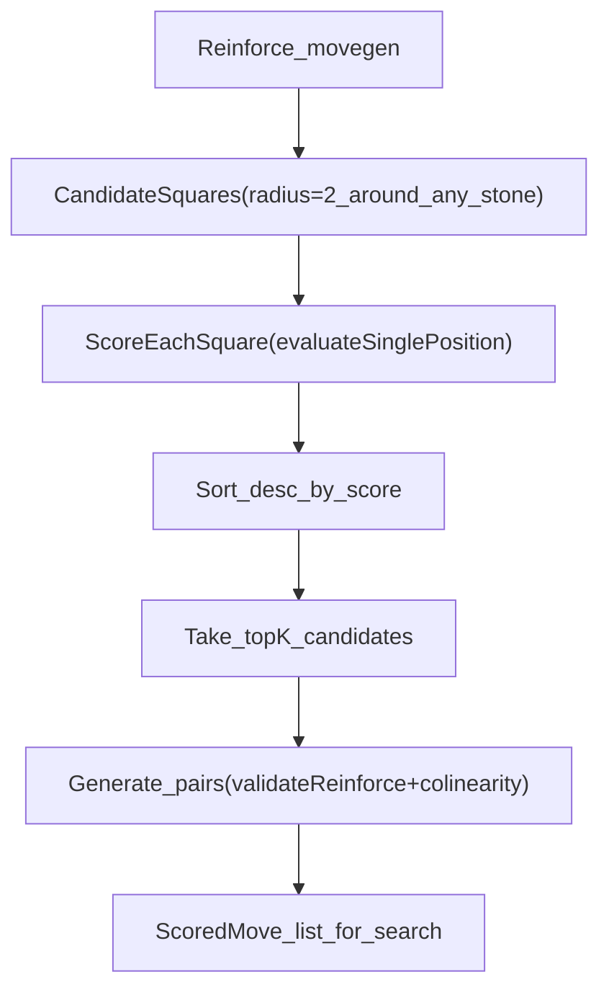

Notes:
- The radius filter is a *branching-factor control*. It is not strictly “closest-first”; the ordering is by heuristic score.
- Config knobs live in `src/lib/game/ai/constants.ts` (`CANDIDATE_RADIUS`, `MAX_CANDIDATES`, `MAX_PAIRS`).
- File: `src/lib/game/ai/moveGen.ts` (`getCandidatePositions`, `scoreCandidates`, `generateReinforceMoves`).

---

### “Must-block” logic (tactical priority)

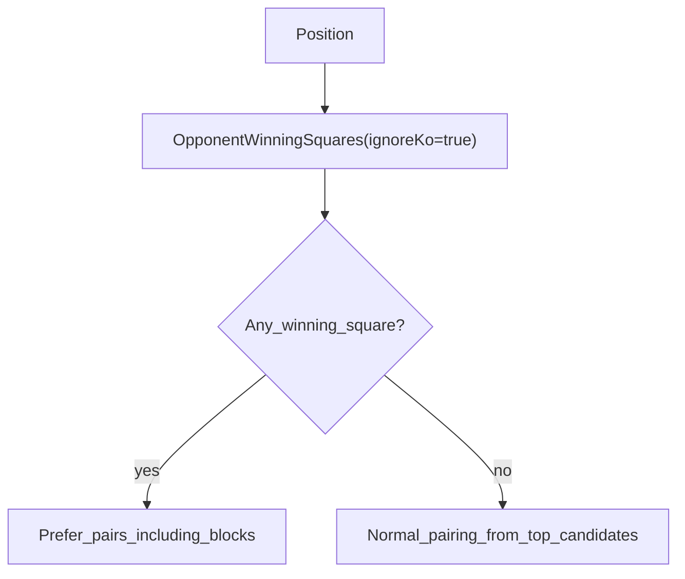

- Winning squares come from pattern detection (`findWinningPositionsAssumingKoClears`) in `src/lib/game/ai/threats.ts`.
- Blocking squares are assembled via a scratch “blocking mask” from threat patterns (`getBlockingMask`).

---

### Pattern/threat pipeline (how “winning squares” are detected)

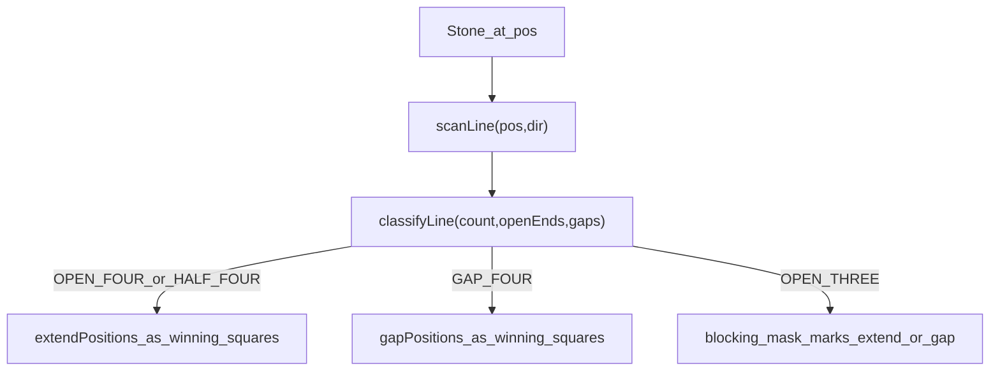

Files:
- `src/lib/game/ai/patterns.ts`: `scanLine`, `classifyLine`, `countPatterns`.
- `src/lib/game/ai/threats.ts`: `findWinningPositions*`, `getBlockingMask`, threat levels/forks.

---

### Evaluation stack (handcrafted + optional NNUE)

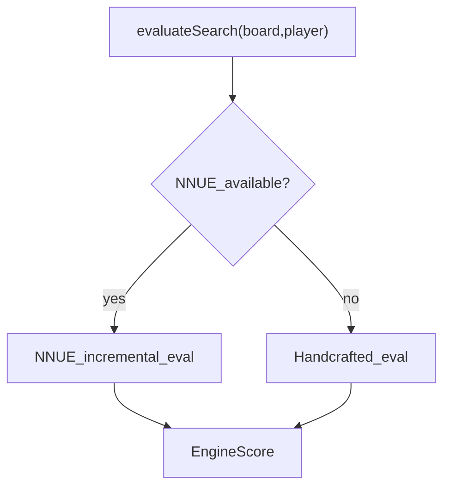

Handcrafted eval (high level):
- patterns (exact-5 aware), threat levels, fork bonuses, center/connectivity terms.
- File: `src/lib/game/ai/evaluate.ts`.

NNUE (high level):
- 1-layer accumulator: add/remove features on moves; eval is `tanh(dot(relu(hidden),outW)+bias+phase+stm)`.
- Files: `src/lib/game/ai/nnue/evaluator.ts`, `src/lib/game/ai/nnue/weights.ts`.

---

### Search: top-level decision policy

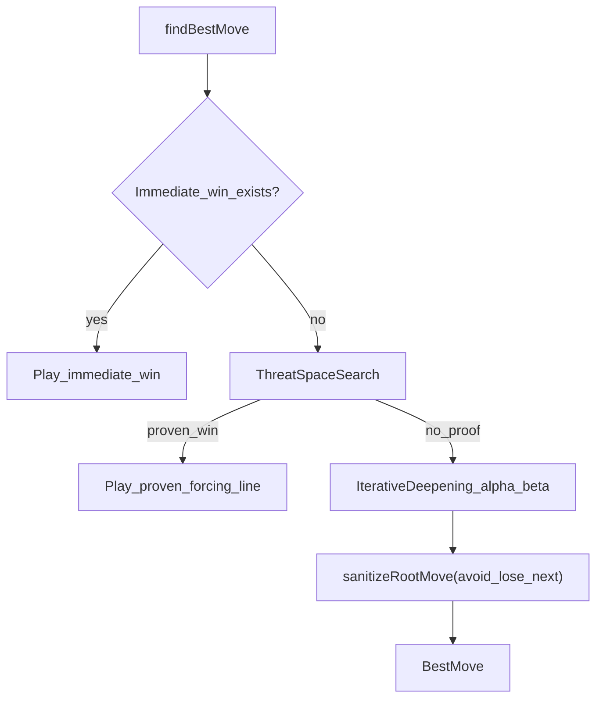

Notes:
- TSS is a conservative tactical prover for forcing chains (VCT/VCF style), adapted to Rift rules.
- Root safety rejects moves that allow an immediate opponent win even under low time budgets.
- File: `src/lib/game/ai/search.ts`, `src/lib/game/ai/tss.ts`.

---

### Search core: iterative deepening + alpha-beta(PVS)

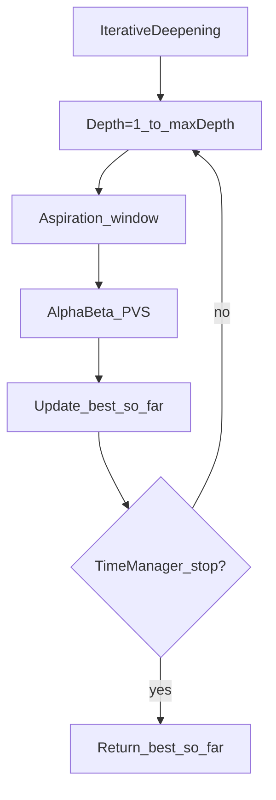

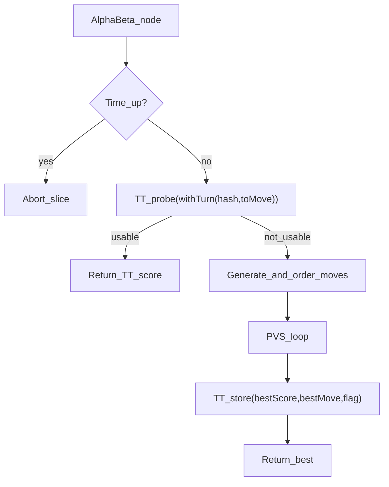

Move ordering & pruning (where strength/speed tradeoffs live):
- TT best-move hint, killer moves, history heuristic: `src/lib/game/ai/moveOrder.ts`.
- Root progressive widening + NNUE-assisted top-K reordering.
- NMP/LMR/futility pruning + quiescence for tactical stability: `src/lib/game/ai/search.ts`.

---

### Pondering (dual-session reuse)

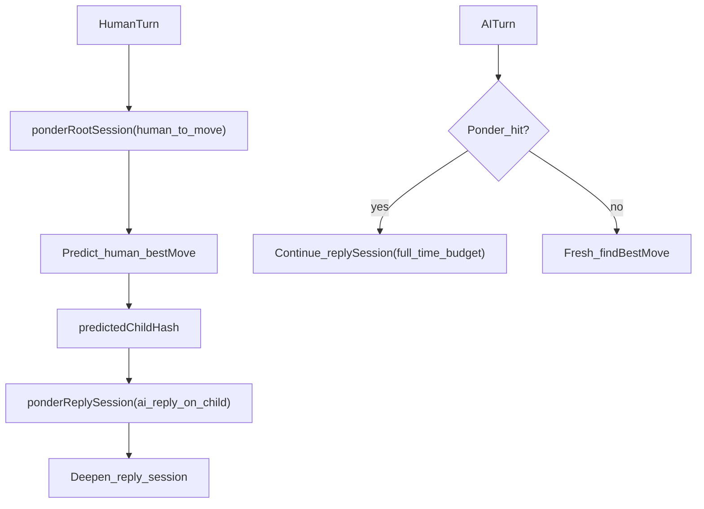

Implementation:
- `src/lib/game/ai.worker.ts`: maintains `ponderRootSession` + `ponderReplySession`, reuses reply session on hit.
- `src/lib/game/engine.ts`: starts/stops pondering and logs a “ponder impact” report when the move returns.

---

### Appendix: module map

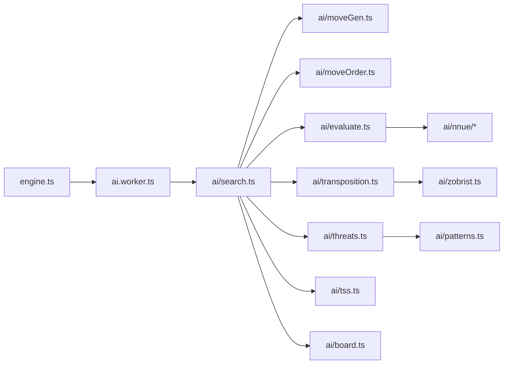

